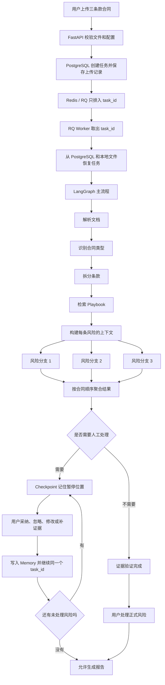

# LangGraph 合同审查全流程：用一份三条款合同从头走一遍

## 1. 这份文档解决什么问题

这不是一份“类和方法清单”，而是一遍完整演练。

你可以把它当成系统运行时的跟拍记录。每一步都回答下面五个问题：

1. 现在轮到谁工作？
2. 它拿到了什么？
3. 它做了什么？
4. 它产出了什么？
5. 结果存到了哪里？

文中的合同、规则、风险和编号都是为了讲清流程而编写的教学示例，不是真实法律意见，也不保证与项目当前 Playbook 的具体文案完全一致。

### 第一次阅读怎么读

不用第一次就记住所有表名和状态名。

先按下面顺序读一遍主线：

```text
第 2 节：认识示例合同
-> 第 3、4 节：认识角色和路线图
-> 第 7 至 20 节：跟着合同走到风险汇总
-> 第 23 至 25 节：看人工反馈、Memory 和报告
-> 第 31 节：最后再用一句话复述
```

第二遍再看：

```text
第 5 节：三种 State 为什么不一样
第 21、22 节：SSE 和 Checkpoint
第 26 至 30 节：存储、恢复、异常和代码入口
```

每一节里的 JSON 都是“这一刻的数据照片”。先看字段表达的意思，不需要背字段名。

---

## 2. 先认识这次要审查的合同

假设用户从甲方立场审查下面这份极简 NDA：

```text
《简易保密协议》

甲方：星河公司
乙方：小林

第1条 乙方不得向第三方泄露甲方提供的客户名单。
第2条 保密义务自签署日起持续1年。
第3条 乙方违反保密义务时，赔偿甲方1000元。
```

为了演示，假设项目的 NDA Playbook 有三条要求：

| 规则 | 通俗解释 |
|---|---|
| `RULE-NDA-001` | 合同应明确约束接收方不得泄密 |
| `RULE-NDA-002` | 保密期建议不少于 3 年 |
| `RULE-NDA-003` | 违约责任应足以覆盖损失，不能明显过轻 |

我们预期会得到：

| 合同条款 | 预期结果 |
|---|---|
| 第1条 | 已经有明确保密义务，不形成风险 |
| 第2条 | 只有 1 年，形成“保密期过短”风险 |
| 第3条 | 固定赔偿 1000 元可能过低，形成“违约责任不足”风险 |

注意：系统不能因为我们“预期如此”就直接输出这个答案。它仍然必须完成解析、检索、分析、复核和证据校验。

---

## 3. 先看全景：一份合同会经过哪些人

这里的“人”既包括程序模块，也包括真实用户。

| 角色 | 可以把它理解成 | 在项目里负责什么 |
|---|---|---|
| 前端页面 | 接待窗口 | 收文件、显示进度、展示风险、接收人工操作 |
| FastAPI | 前台接待员 | 校验请求、创建任务、提供查询和反馈接口 |
| PostgreSQL | 总档案室 | 保存任务、条款、风险、事件、日志和 Memory，是业务数据的最终依据 |
| 本地上传目录 | 原件柜 | 保存用户上传的 PDF 或 DOCX 原文件 |
| Redis | 叫号器和通知器 | 保存 RQ 排队信息，并通知前端“数据库里有新事件” |
| RQ Worker | 后台办事员 | 从队列取出任务，在独立进程中执行耗时审查 |
| LangGraph | 流程管理员 | 决定先做什么、下一步去哪、何时分支、何时暂停 |
| Tool Registry | 允许使用的工具清单 | 把工具名称映射到真实 Python 函数，限制 Agent 只能调用白名单工具 |
| DeepSeek | 文字分析员 | 在真实 LLM 模式下做结构化判断、风险分析、Critic 和 Planner 决策 |
| BGE + pgvector | 语义检索员 | 把文字变成向量，查找意思相近的条款、规则和历史反馈 |
| Evidence Verifier | 证据核对员 | 检查风险引用的文字是否真的存在于合同原文 |
| Checkpointer | 流程书签 | 只记住暂停位置和待处理风险，不复制完整合同 |
| 用户 | 最终复核人 | 采纳、忽略、改等级、改建议或补充证据 |
| Memory | 反馈经验本 | 记录用户最终怎么处理风险，供以后相似审查参考 |

最重要的边界是：

> PostgreSQL 保存“事情本身”，LangGraph Checkpoint 保存“流程走到哪里”，Redis 只负责“排队和提醒”。

三者不能混为一谈。

---

## 4. 整体路线图



---

## 5. 系统里有三种不同的“状态”

读 LangGraph 代码时，最容易混淆的是“为什么到处都有 state”。实际上它们用途不同。

### 5.1 `AgentState`：完整业务档案

它代表“这份合同现在审到什么程度，已经得到什么结果”。

它会包含：

```json
{
  "task_id": "task_demo001",
  "status": "CONTEXT_BUILT",
  "file_name": "简易保密协议.pdf",
  "review_position": "甲方",
  "document": {"...": "解析后的文档"},
  "clauses": [{"...": "所有条款"}],
  "matched_rules": [{"...": "命中的规则"}],
  "review_contexts": [{"...": "风险分析上下文"}],
  "risk_findings": [],
  "events": [{"...": "前端进度事件"}],
  "logs": [{"...": "工具执行记录"}]
}
```

完整内容存进 PostgreSQL。服务重启后仍然能恢复。

### 5.2 `ReviewGraphState`：LangGraph 手上的临时工作单

主流程不需要每经过一个节点都搬运整份合同，只传最少的数据：

```json
{
  "task_id": "task_demo001",
  "terminal": false,
  "risk_items": ["待处理风险工作项"],
  "risk_results": ["已经完成的风险分支结果"]
}
```

处理单条风险时，还会暂时出现：

```json
{
  "risk_item": {"index": 1, "review_context": {"...": "..."}},
  "branch_route": "verify_evidence",
  "branch_payload": {"...": "当前这一条风险的中间数据"}
}
```

它像一张在办公室里传递的工作单，不是最终档案。

### 5.3 `ReviewControlState`：人工暂停书签

人工复核可能停几个小时甚至几天，所以控制图只保存：

```json
{
  "task_id": "task_demo001",
  "phase": "human_review",
  "status": "HUMAN_REVIEW_PENDING",
  "pending_risk_ids": ["RISK-CL-002", "RISK-CL-003"],
  "recovery_count": 0
}
```

它不保存合同正文。继续时根据 `task_id` 去 PostgreSQL 重新读取完整任务。

项目固定使用：

```text
thread_id = task_id
```

可以把 `thread_id` 理解成书签编号。暂停和继续必须使用同一个编号，否则 LangGraph 会认为这是另一本书。

---

## 6. 第 0 步：用户还没上传，系统先检查自己能不能工作

### 谁在做

FastAPI 的依赖检查，以及 `QueuedReviewService`。

### 做什么

新任务创建前，系统会确认：

- PostgreSQL 能连接；
- Redis 能连接；
- RQ Worker 真实在线；
- 用户选择 DeepSeek 时，LLM 配置可用。

### 为什么先检查

如果 Worker 不在线却先返回“任务创建成功”，用户会看到一个永远不执行的假任务。

### 失败时会怎样

API 返回真实的依赖错误，例如 HTTP 503，不创建看似成功的业务任务。

### 对应代码

- `backend/app/api/routes/tasks.py`
- `backend/app/services/task_queue.py`
- `backend/app/services/application_runtime.py`

---

## 7. 第 1 步：上传合同并创建任务

### 谁在做

前端页面和 FastAPI。

### 输入是什么

```text
文件：简易保密协议.pdf
审查立场：甲方
LLM 模式：deepseek
```

### FastAPI 先做哪些检查

1. 请求是不是 `multipart/form-data`；
2. 文件扩展名是不是 PDF 或 DOCX；
3. MIME 类型和扩展名是否匹配；
4. 文件头是否真的是对应格式；
5. 文件大小是否超限；
6. 文件名是否安全；
7. DeepSeek 模式的配置是否有效。

### 创建出的第一份任务数据

下面是简化后的教学数据：

```json
{
  "task_id": "task_demo001",
  "trace_id": "trace_demo001",
  "status": "START",
  "file_name": "简易保密协议.pdf",
  "file_type": "pdf",
  "review_position": "甲方",
  "llm_mode": "deepseek",
  "message": "审查任务已创建"
}
```

接着状态更新为：

```json
{
  "status": "UPLOAD_RECEIVED",
  "message": "上传已接收，等待 RQ Worker 执行"
}
```

### 文件和数据分别存到哪里

| 内容 | 去向 |
|---|---|
| PDF 原文件 | D 盘配置的本地上传目录 |
| 文件 SHA-256 | PostgreSQL `app.documents` |
| 文件相对存储路径 | PostgreSQL `app.documents` |
| 任务状态 | PostgreSQL `app.review_tasks` |
| “任务创建”“上传已接收”事件 | PostgreSQL `app.task_events` |

文件哈希像原件指纹。恢复任务时，系统重新读取文件并计算哈希；对不上就拒绝继续，避免拿错文件。

### 对应代码

- 接口：`backend/app/api/routes/tasks.py`
- 创建任务：`backend/app/services/event_service.py`
- 保存任务和原文件：`backend/app/db/postgres_persistence.py`

---

## 8. 第 2 步：任务进入 Redis / RQ 队列

### 谁在做

`QueuedReviewService` 和 RQ。

### 队列里放什么

只放：

```json
{
  "job_id": "review-task_demo001",
  "task_id": "task_demo001"
}
```

不会把整份 PDF、全部条款或完整 `AgentState` 塞进 Redis。

### 为什么只放 `task_id`

因为 PostgreSQL 才是最终档案。Worker 拿到编号后自己查询数据库：

- Redis 丢了，可以根据 PostgreSQL 重建待执行任务；
- Worker 重启，不依赖旧进程内存；
- 队列消息不会因为合同太大而变得臃肿；
- 不会出现 Redis 和 PostgreSQL 各保存一份完整任务但内容不一致。

### RQ 的职责

RQ 只回答两个问题：

1. 哪个任务该执行？
2. 哪个 Worker 来执行？

它不负责判断合同风险。

### 对应代码

- `backend/app/services/task_queue.py`

---

## 9. 第 3 步：RQ Worker 接手

### 谁在做

独立运行的 RQ Worker。

### Worker 拿到什么

```text
task_id = task_demo001
```

### Worker 接下来做什么

1. 从 PostgreSQL 查询任务；
2. 如果任务已经结束，不重复执行；
3. 从本地上传目录读取 PDF；
4. 验证文件 SHA-256；
5. 调用 LangGraph Agent：

```python
runtime.review_agent.run(task_id, content)
```

### 为什么放在独立 Worker

合同解析、向量检索和 DeepSeek 调用可能运行很久。如果直接放在 FastAPI 请求线程里，浏览器连接断开或请求超时就可能影响任务。

Worker 让“用户的 HTTP 请求”与“后台长期审查”分开。

### 对应代码

- `backend/app/workers/review_worker.py`

---

## 10. 第 4 步：LangGraph 开始管理主流程

### LangGraph 到底是什么

在这个项目里，LangGraph 不是“替你审合同的模型”。

它更像一张带条件的流程图：

```text
解析成功 -> 去分类
分类是 NDA -> 去拆条款
分类不支持 -> 停止
证据有效 -> 完成这一条风险
证据无效且还能修 -> 重新检索
证据仍无效 -> 交给人
```

每个方框叫“节点”，箭头叫“边”，节点返回的数据决定下一条边走向。

### 主图固定顺序

```text
bootstrap
-> parse_document
-> classify_contract
-> structure_clauses
-> retrieve_playbook
-> build_context
-> risk_subgraph
-> aggregate_risks
```

### `bootstrap` 做什么

它准备本次执行需要的运行环境，并检查是否已经有可恢复的数据。

如果任务上次已经解析过文档，恢复时不会故意再解析一遍来制造重复工作。

### 对应代码

- 图的连接方式：`backend/app/services/review_workflow.py`
- 每个节点实际做的工作：`backend/app/services/langgraph_review_agent.py`

---

## 11. 第 5 步：解析 PDF

### 谁在做

LangGraph 的 `parse_document` 节点，通过 Tool Registry 调用同名工具。

### Tool Registry 是什么

它就是一个明确的 Python 字典：

```python
tool_registry = {
    "parse_document": parse_document,
    "analyze_risk": analyze_risk,
    "verify_evidence": verify_evidence,
    # ...
}
```

左边是 Agent 允许说出的工具名，右边是真正执行的函数。

这样做的意义是：模型不能随口要求执行任意系统命令，只能进入已经登记、已经定义输入输出的工具。

### 解析工具拿到什么

```json
{
  "file_name": "简易保密协议.pdf",
  "file_type": "pdf",
  "content": "PDF 二进制内容"
}
```

### Docling 做什么

Docling 负责把 PDF 或 DOCX 转成程序可以处理的统一文档结构。

对真实 PDF，它还需要尽量保留：

- 页码；
- 文本块；
- 表格；
- 文本在页面中的位置；
- 后续定位原文需要的 bbox。

### 教学示例的解析结果

```json
{
  "document_id": "doc_demo001",
  "blocks": [
    {"page": 1, "text": "《简易保密协议》"},
    {"page": 1, "text": "甲方：星河公司"},
    {"page": 1, "text": "乙方：小林"},
    {"page": 1, "text": "第1条 乙方不得向第三方泄露甲方提供的客户名单。"},
    {"page": 1, "text": "第2条 保密义务自签署日起持续1年。"},
    {"page": 1, "text": "第3条 乙方违反保密义务时，赔偿甲方1000元。"}
  ]
}
```

### 数据怎么变化

任务状态：

```text
UPLOAD_RECEIVED -> DOCUMENT_PARSED
```

解析后的 `document_json` 写入 PostgreSQL `app.documents`。

---

## 12. 第 6 步：识别合同类型

### 谁在做

`classify_contract` 节点调用 `classify_contract_type` 工具。

### 为什么要先分类

不同合同要使用不同 Playbook。NDA 的保密期限规则不能直接套到劳动合同或采购合同上。

### 教学结果

```json
{
  "contract_type": "NDA",
  "confidence": 0.98,
  "decision": "SUPPORTED",
  "evidence": [
    "标题包含保密协议",
    "正文出现披露方、接收方和保密义务"
  ]
}
```

### 数据怎么变化

```text
DOCUMENT_PARSED -> CONTRACT_TYPE_CLASSIFIED
```

分类结果写入 `app.review_tasks.contract_classification_json`。

### 如果识别出不是 NDA

当前项目只支持既定合同类型时，不会硬套 NDA 规则。任务会进入“不支持”或人工复核状态，并保留已经解析出的文档。

---

## 13. 第 7 步：把正文拆成条款

### 谁在做

`structure_clauses` 节点调用：

- `extract_clauses`：先切出条款；
- `extract_key_fields`：再提取每条的重点字段。

### 为什么不能直接把整份合同丢给模型

整份合同一起分析会带来三个问题：

1. 输入越来越长，Token 成本增加；
2. 模型容易把不同条款的内容混在一起；
3. 风险无法稳定绑定到具体原文。

### 教学结果

```json
[
  {
    "clause_id": "CL-001",
    "clause_type": "保密义务",
    "text": "第1条 乙方不得向第三方泄露甲方提供的客户名单。",
    "key_fields": {
      "obligation_subject": "乙方",
      "protected_information": "甲方客户名单",
      "prohibited_action": "向第三方泄露"
    },
    "source_location": {"page": 1}
  },
  {
    "clause_id": "CL-002",
    "clause_type": "保密期限",
    "text": "第2条 保密义务自签署日起持续1年。",
    "key_fields": {
      "duration": "1年",
      "start_point": "签署日"
    },
    "source_location": {"page": 1}
  },
  {
    "clause_id": "CL-003",
    "clause_type": "违约责任",
    "text": "第3条 乙方违反保密义务时，赔偿甲方1000元。",
    "key_fields": {
      "trigger": "违反保密义务",
      "compensation": "1000元"
    },
    "source_location": {"page": 1}
  }
]
```

### 数据存到哪里

每条条款单独写入 PostgreSQL `app.clauses`。

条款不只保存正文，还保存：

- `clause_id`：稳定编号；
- `clause_type`：条款类型；
- `search_text`：用于检索的文字；
- `key_fields_json`：关键字段；
- `source_location_json`：原文位置；
- `payload_json`：完整条款结构。

### 数据怎么变化

```text
CONTRACT_TYPE_CLASSIFIED -> CLAUSES_STRUCTURED
```

---

## 14. 第 8 步：检索 Playbook 规则

### 谁在做

`retrieve_playbook` 节点调用 `retrieve_playbook_rules`。

### Playbook 是什么

Playbook 是审查标准，不是合同原文。

合同说“现在写了什么”，Playbook 说“公司希望它写成什么样”。

### 教学匹配结果

```json
[
  {
    "clause_id": "CL-001",
    "matched_rules": ["RULE-NDA-001"]
  },
  {
    "clause_id": "CL-002",
    "matched_rules": ["RULE-NDA-002"]
  },
  {
    "clause_id": "CL-003",
    "matched_rules": ["RULE-NDA-003"]
  }
]
```

### 数据怎么变化

```text
CLAUSES_STRUCTURED -> PLAYBOOK_RETRIEVED
```

匹配结果写入 `app.review_tasks.matched_rules_json`。

---

## 15. 第 9 步：给每条风险准备上下文

### “上下文”是什么意思

模型不能只看到一句“分析 CL-002”。它至少需要知道：

- 当前条款原文；
- 当前审查立场；
- 命中的 Playbook 规则；
- 合同里意思相近的其他条款；
- 过去用户怎么处理过类似风险；
- 哪些信息来自合同，哪些来自规则，哪些来自 Memory。

把这些材料装成一个受控输入，就是构建上下文。

### 谁在做

`build_context` 节点使用 `ReviewContextPipeline`，组合下面几个工具：

| 工具 | 通俗作用 |
|---|---|
| `retrieve_related_clauses` | 找合同中意思相近、可能互相补充的条款 |
| `retrieve_memory` | 找过去相似的人工反馈 |
| `extract_key_fields` | 提取条款中的期限、金额、主体等重点 |
| 上下文预算器 | 内容太长时决定保留什么、裁掉什么 |

### BGE、向量和 pgvector 在做什么

电脑不能直接按“意思”比较两段中文，所以 BGE 会把一句话变成一串数字：

```text
"保密义务持续1年"
        ↓ BGE
[0.018, -0.042, 0.113, ... 共 1024 个数]
```

这串数叫向量。意思越接近的文字，向量距离通常越近。

`pgvector` 是 PostgreSQL 的向量能力，用来保存和搜索这类数据。

项目还会同时做关键词检索，然后把两路候选合并，再用 reranker 重新排序。reranker 可以理解成“初选完成后的复试官”。

### CL-002 的教学上下文

```json
{
  "context_id": "CTX-CL-002-RULE-NDA-002",
  "review_position": "甲方",
  "clause": {
    "clause_id": "CL-002",
    "text": "第2条 保密义务自签署日起持续1年。"
  },
  "playbook_rule": {
    "rule_id": "RULE-NDA-002",
    "requirement": "保密期建议不少于3年"
  },
  "related_clauses": [
    {
      "clause_id": "CL-001",
      "reason": "同样涉及保密义务"
    }
  ],
  "memory": [
    {
      "summary": "过去甲方审查中，1年保密期通常被调整为3年"
    }
  ]
}
```

### 一个重要优先级

```text
合同原文和 Playbook > Memory
```

Memory 是参考经验，不能覆盖合同事实，也不能把过去用户的偏好冒充成当前 Playbook。

### 数据怎么变化

```text
PLAYBOOK_RETRIEVED -> CONTEXT_BUILT
```

上下文写入 `app.review_tasks.review_contexts_json`。

---

## 16. 第 10 步：LangGraph 把三条风险分开处理

### 为什么要分支

CL-001、CL-002 和 CL-003 互不依赖。处理 CL-002 时，不必等待 CL-001 的模型调用全部结束。

LangGraph 使用 `Send` 为每个 `risk_item` 创建一个风险子图调用：

```text
risk_item 0 -> 风险子图 A
risk_item 1 -> 风险子图 B
risk_item 2 -> 风险子图 C
```

DeepSeek 模式下，项目默认最多同时运行 2 个分支。

这表示可能先运行 A 和 B，任意一个完成后再运行 C。它不是一次发出无限多个请求。

### 分支开始前的临时 State

```json
{
  "task_id": "task_demo001",
  "risk_items": [
    {"index": 0, "review_context": "CTX-CL-001-RULE-NDA-001"},
    {"index": 1, "review_context": "CTX-CL-002-RULE-NDA-002"},
    {"index": 2, "review_context": "CTX-CL-003-RULE-NDA-003"}
  ],
  "risk_results": []
}
```

### 每条风险内部固定经过什么

```text
prepare_risk
-> analyze_risk
-> criticize_risk
-> verify_evidence
-> finalize_risk
```

证据不足时允许：

```text
verify_evidence
-> repair_retrieval
-> analyze_risk
```

这条证据修复路线最多执行一次，不允许无限循环烧 Token。

---

## 17. 风险分支 A：CL-001 没有风险

### 17.1 `prepare_risk`

它把 CL-001 的上下文放进本分支工作区，并判断是否已有可恢复结果。

### 17.2 `analyze_risk`

Risk Analyzer 比较合同原文和规则：

```text
合同：乙方不得向第三方泄露客户名单
规则：应明确约束接收方不得泄密
```

教学输出：

```json
{
  "clause_id": "CL-001",
  "review_status": "NO_RISK",
  "risk_reason": "合同已经明确约束乙方不得向第三方泄露客户名单。"
}
```

### 17.3 后续怎么走

`NO_RISK` 不需要生成正式风险，分支直接整理结果：

```json
{
  "index": 0,
  "outcome": "no_risk",
  "risk_finding": null
}
```

它仍然保留分析过程，方便审计为什么没有报风险；但不会出现在正式风险列表里。

---

## 18. 风险分支 B：CL-002 自动通过证据校验

### 18.1 Risk Analyzer 先提出风险

输入要点：

```text
合同原文：保密义务自签署日起持续1年
Playbook：建议不少于3年
审查立场：甲方
```

教学输出：

```json
{
  "risk_id": "RISK-CL-002",
  "clause_id": "CL-002",
  "risk_type": "保密期限过短",
  "severity": "中",
  "risk_reason": "1年短于Playbook建议的3年，可能不足以覆盖信息持续敏感的期间。",
  "evidence_text": "保密义务自签署日起持续1年",
  "revision_suggestion": "将保密期限调整为至少3年。",
  "review_status": "PENDING_VERIFICATION"
}
```

Analyzer 的职责是“提出结论”，不是证明自己一定正确。

### 18.2 Critic 再挑一次问题

Critic 主要检查：

- 风险原因是否真的由输入材料支持；
- 审查立场有没有弄反；
- 风险类型和规则是否匹配；
- 是否把合同中的恶意指令当成系统指令；
- 建议是否凭空增加无关内容。

教学结果：

```json
{
  "critic_status": "PASS",
  "reason": "风险原因与规则和条款原文一致。"
}
```

Critic 不是第二个自由发挥的作者。它不能自己创造新证据。

### 18.3 Evidence Verifier 核对原文

它检查：

```text
"保密义务自签署日起持续1年"
```

是否真实出现在 CL-002 的原文中。

教学结果：

```json
{
  "risk_id": "RISK-CL-002",
  "is_valid": true,
  "status": "VERIFIED",
  "source_location": {
    "clause_id": "CL-002",
    "page": 1
  }
}
```

于是正式风险变成：

```json
{
  "risk_id": "RISK-CL-002",
  "review_status": "VERIFIED_RISK",
  "evidence_verification": {
    "is_valid": true,
    "status": "VERIFIED"
  }
}
```

---

## 19. 风险分支 C：CL-003 的证据第一次失败

这一段专门演示“模型的方向可能对，但引用文字不真实”。

### 19.1 Analyzer 第一次输出

假设模型输出：

```json
{
  "risk_id": "RISK-CL-003",
  "clause_id": "CL-003",
  "risk_type": "违约责任不足",
  "severity": "高",
  "risk_reason": "固定1000元赔偿可能不足以覆盖甲方实际损失。",
  "evidence_text": "乙方仅赔偿1000元且不承担其他损失",
  "revision_suggestion": "增加实际损失、调查费和维权费用的赔偿责任。"
}
```

风险方向可能合理，但原合同没有写：

```text
且不承担其他损失
```

### 19.2 Evidence Verifier 拒绝它

教学结果：

```json
{
  "risk_id": "RISK-CL-003",
  "is_valid": false,
  "failure_reason": "evidence_text does not occur in source clause"
}
```

系统不会因为模型“看起来说得通”就把不存在的文字当证据。

### 19.3 Planner 决定下一步

Planner 不是让模型任意想一个工具名，而是从白名单动作中选：

```text
重新检索
重新分析
请求人工复核
停止
```

假设这次选择：

```json
{
  "action": "RETRIEVE_AGAIN",
  "query_adjustments": ["违约金", "固定赔偿", "实际损失"]
}
```

### 19.4 `repair_retrieval` 只修一次

系统换检索词，重新找相关条款和 Memory，再回到 Analyzer。

如果第二次输出改成真实原文：

```json
{
  "evidence_text": "乙方违反保密义务时，赔偿甲方1000元"
}
```

证据可以通过，分支自动结束。

为了继续演示人工流程，假设第二次仍然给出不在原文中的证据。系统不会第三次、第四次无限重试，而是保存候选风险：

```json
{
  "risk_id": "RISK-CL-003",
  "review_status": "NEED_MANUAL_REVIEW",
  "evidence_verification": {
    "is_valid": false,
    "failure_reason": "第二次证据仍无法在原文中定位"
  }
}
```

方向和过程被保留，但它不能冒充“已验证风险”。

---

## 20. 第 11 步：汇总三个分支

### 为什么还要汇总

并行完成顺序可能是：

```text
CL-002 -> CL-001 -> CL-003
```

用户看到的结果必须保持合同原始顺序：

```text
CL-001 -> CL-002 -> CL-003
```

所以每个分支都带一个 `index`，`aggregate_risks` 先按 `index` 排序。

### `risk_results` 为什么不会互相覆盖

`ReviewGraphState` 对它声明了列表合并规则。可以把它理解成：

```text
分支 A 返回 [A]
分支 B 返回 [B]
分支 C 返回 [C]
LangGraph 合并为 [A, B, C]
```

而不是最后完成的 C 把 A、B 覆盖掉。

### 汇总后的教学数据

```json
{
  "analysis_results": [
    {"clause_id": "CL-001", "review_status": "NO_RISK"},
    {"clause_id": "CL-002", "review_status": "VERIFIED_RISK"},
    {"clause_id": "CL-003", "review_status": "NEED_MANUAL_REVIEW"}
  ],
  "risk_findings": [
    {"risk_id": "RISK-CL-002", "review_status": "VERIFIED_RISK"},
    {"risk_id": "RISK-CL-003", "review_status": "NEED_MANUAL_REVIEW"}
  ]
}
```

CL-001 有分析记录，但没有正式风险，所以 `risk_findings` 只有两条。

### 状态怎么变化

先记录：

```text
CONTEXT_BUILT -> RISK_ANALYZED
```

因为 CL-003 需要人工处理，最终变成：

```text
RISK_ANALYZED -> HUMAN_REVIEW_PENDING
```

如果两个风险的证据都自动通过，则会变成：

```text
RISK_ANALYZED -> EVIDENCE_VERIFIED
```

### 这时存什么

| 数据 | PostgreSQL 位置 |
|---|---|
| 当前任务状态 | `app.review_tasks` |
| 两条正式风险 | `app.risk_findings` |
| Analyzer 中间结果 | `review_tasks.analysis_results_json` |
| Evidence 结果 | `review_tasks.evidence_results_json` |
| 每个工具的耗时、输入输出摘要、重试 | `app.step_logs` |
| 前端进度事件 | `app.task_events` |

---

## 21. 前端为什么能逐步看到进度

每次关键状态或进度变化时，`ReviewEventStore` 会同时做两件事：

1. 把新的任务状态和事件放在同一个 PostgreSQL 事务中提交；
2. 提交成功后，用 Redis 发一条“有新事件”的通知。

SSE 接口的工作方式是：

```text
先从 PostgreSQL 查询 event_id 之后的新事件
-> 没有事件时等待 Redis 通知
-> 收到通知后再次查 PostgreSQL
-> 把真实数据库事件推给浏览器
```

Redis 通知就算偶尔丢失，SSE 仍会重新查询 PostgreSQL，不会把 Redis 当作唯一事件来源。

教学事件可能是：

```json
[
  {"event_id": 0, "status": "START", "message": "任务已创建"},
  {"event_id": 1, "status": "UPLOAD_RECEIVED", "message": "等待 Worker"},
  {"event_id": 2, "status": "DOCUMENT_PARSED", "message": "文档解析完成"},
  {"event_id": 3, "status": "CONTRACT_TYPE_CLASSIFIED", "message": "识别为 NDA"},
  {"event_id": 4, "status": "CLAUSES_STRUCTURED", "message": "已拆出 3 条条款"},
  {"event_id": 5, "status": "PLAYBOOK_RETRIEVED", "message": "规则检索完成"},
  {"event_id": 6, "status": "CONTEXT_BUILT", "message": "风险上下文已构建"},
  {"event_id": 7, "status": "CONTEXT_BUILT", "message": "风险分析 1/3"},
  {"event_id": 8, "status": "CONTEXT_BUILT", "message": "风险分析 2/3"},
  {"event_id": 9, "status": "CONTEXT_BUILT", "message": "风险分析 3/3"},
  {"event_id": 10, "status": "HUMAN_REVIEW_PENDING", "message": "存在待人工复核风险"}
]
```

刷新页面时，前端通过任务查询接口重新从 PostgreSQL 加载完整任务，所以不应该依赖浏览器内存保存审查记录。

对应代码：

- 事件写入：`backend/app/services/event_service.py`
- PostgreSQL 持久化：`backend/app/db/postgres_persistence.py`
- SSE：`backend/app/api/routes/tasks.py`
- 跨进程事件等待：`backend/app/services/event_notification.py`

---

## 22. 第 12 步：LangGraph 在人工复核处暂停

### 谁在做

LangGraph 的控制图，不是主业务图。

### 为什么单独做控制图

主业务数据已经在 PostgreSQL，不需要把整份合同塞进 Checkpoint。

控制图只负责：

```text
现在是不是在等人？
还有哪些风险没处理？
用户回来后从哪继续？
```

### `interrupt()` 做什么

当任务进入人工复核，控制节点调用 `interrupt()`。

可以把它理解成：

> 程序在这里放下书签，主动结束本次运行，等待外部给出答案。

Checkpoint 保存的是：

```json
{
  "thread_id": "task_demo001",
  "phase": "human_review",
  "pending_risk_ids": ["RISK-CL-002", "RISK-CL-003"]
}
```

合同原文、全部条款和风险详情仍在 PostgreSQL `app` schema。

Checkpoint 存在 PostgreSQL 的 `langgraph` schema。

---

## 23. 第 13 步：用户处理风险

界面支持五种动作：

| 动作 | 对风险做什么 | 是否写 Memory |
|---|---|---|
| 采纳 | 标成 `CONFIRMED_RISK` | 是 |
| 忽略 | 标成 `IGNORED_RISK`，默认不进报告 | 是 |
| 修改等级 | 保存用户选定的高、中、低 | 是 |
| 修改建议 | 保存用户改写后的建议 | 是 |
| 补充证据 | 验证所选文字确实来自当前条款，再标成人工验证 | 是 |

### 23.1 用户采纳 CL-002

请求可以简化成：

```json
{
  "risk_id": "RISK-CL-002",
  "action": "accept",
  "include_in_report": true
}
```

风险变成：

```json
{
  "risk_id": "RISK-CL-002",
  "review_status": "CONFIRMED_RISK",
  "include_in_report": true,
  "feedback": {
    "user_action": "accept",
    "action_label": "采纳"
  }
}
```

此时 CL-003 还没处理，所以任务仍然是：

```text
HUMAN_REVIEW_PENDING
```

控制图被 `Command(resume=...)` 唤醒，重新查询数据库，发现还有一个待处理风险，于是再次 `interrupt()`。

### 23.2 用户给 CL-003 补充真实证据

用户在原文中框选：

```text
乙方违反保密义务时，赔偿甲方1000元
```

请求简化为：

```json
{
  "risk_id": "RISK-CL-003",
  "action": "update_evidence",
  "final_evidence_text": "乙方违反保密义务时，赔偿甲方1000元",
  "include_in_report": true
}
```

后端先检查这段文字是否真的包含在 CL-003 原文里。通过后：

```json
{
  "risk_id": "RISK-CL-003",
  "review_status": "CONFIRMED_RISK",
  "evidence_text": "乙方违反保密义务时，赔偿甲方1000元",
  "evidence_verification": {
    "status": "MANUALLY_VERIFIED",
    "is_valid": true,
    "resolution": "HUMAN_SELECTED_SOURCE"
  }
}
```

两个风险都已处理，任务变成：

```text
HUMAN_REVIEW_PENDING -> MEMORY_UPDATED
```

控制图再次被唤醒，发现 `pending_risk_ids=[]`，这次走到结束，不再暂停。

### 对应代码

- 反馈接口：`backend/app/api/routes/feedback.py`
- 修改风险和写 Memory：`backend/app/services/feedback_service.py`
- 暂停与继续：`backend/app/services/langgraph_review_agent.py`

---

## 24. Memory 到底记了什么

Memory 不保存一句含糊的“用户喜欢高风险”，而是保存一次可追溯的反馈事实。

CL-002 的教学 Memory：

```json
{
  "memory_id": "memory_demo002",
  "contract_type": "NDA",
  "clause_type": "保密期限",
  "risk_type": "保密期限过短",
  "review_position": "甲方",
  "user_action": "accept",
  "original_severity": "中",
  "final_severity": "中",
  "original_suggestion": "调整为至少3年",
  "final_suggestion": "调整为至少3年",
  "source_finding_id": "RISK-CL-002",
  "source_clause_id": "CL-002",
  "include_in_report": true
}
```

以后遇到相似的 NDA 保密期限条款，`retrieve_memory` 可以找到这条反馈，告诉 Analyzer：

> 过去在甲方立场下，用户采纳过这类风险。

它只能作为参考，不能替代当前合同证据和 Playbook。

多次相似反馈还可以聚合成偏好，并记录：

- 支持次数；
- 反对次数；
- 是否存在冲突；
- 当前置信度；
- 是否过期；
- 来源 Memory 编号。

原始反馈存入 `app.memory_items`，聚合偏好存入 `app.semantic_preferences`。

---

## 25. 第 14 步：生成报告

### 谁在做

报告接口调用 Tool Registry 中的 `generate_report`。

### 什么情况下允许生成

任务必须已经完成人工处理，当前实现允许：

```text
MEMORY_UPDATED
REPORT_READY
```

不能在还有待人工风险时把草稿当成正式报告。

### 哪些风险会进入报告

风险需要同时满足：

- `include_in_report` 是 `true`；
- 不是 `NO_RISK`；
- 不是 `NEED_MANUAL_REVIEW`。

“忽略风险”默认不进入报告；如果调用方明确选择加入，当前筛选逻辑允许保留。

### 教学报告结果

```json
{
  "report_id": "report_task_demo001",
  "task_id": "task_demo001",
  "format": "markdown",
  "risk_count": 2,
  "path": "D盘报告目录/task_demo001.md"
}
```

任务状态：

```text
MEMORY_UPDATED -> REPORT_READY
```

报告本身写入配置的报告目录，报告元数据写入 `review_tasks.report_file_json`。

### 对应代码

- 接口：`backend/app/api/routes/reports.py`
- 任务级幂等控制：`backend/app/services/report_task_service.py`
- 报告内容筛选：`backend/app/services/report_service.py`

---

## 26. 整个流程结束后，数据库大概有什么

下面仍然是教学数量，不是固定生产结果。

| 表或存储 | 本示例大概有什么 |
|---|---|
| `app.review_tasks` | 1 个任务，状态 `REPORT_READY` |
| `app.documents` | 1 份解析结果、文件哈希和原文件路径 |
| `app.clauses` | 3 条结构化条款 |
| `app.clause_embeddings` | 条款对应的 BGE 向量，数量取决于实际索引过程 |
| `app.risk_findings` | 2 条正式风险 |
| `app.step_logs` | 解析、检索、模型、Critic、证据等每次工具调用记录 |
| `app.task_events` | 从创建到报告完成的递增事件 |
| `app.memory_items` | 2 条人工反馈 |
| `app.semantic_preferences` | 可能根据历史反馈聚合出的偏好，不保证本次一定新增 |
| `app.idempotency_records` | 需要防重复写入的 Memory 或报告操作结果 |
| PostgreSQL `langgraph` schema | `task_demo001` 的流程书签和暂停记录 |
| Redis | RQ Job、Worker 心跳、缓存和短暂通知，不保存完整业务真相 |
| D 盘上传目录 | 原始 PDF |
| D 盘日志目录 | 应用和 Worker 运行日志 |
| D 盘报告目录 | 最终 Markdown 报告 |

---

## 27. 服务重启后为什么还能继续

假设 Worker 在完成 CL-001 和 CL-002 后突然退出。

### 不可靠的数据

旧 Worker 内存中的 Python 对象已经消失，不能依赖。

### 仍然存在的数据

PostgreSQL 中仍然有：

- 原任务状态；
- 已解析文档；
- 3 条条款；
- 已命中规则；
- 已构建上下文；
- 已完成的分析和证据结果；
- 最新事件编号；
- 执行进度。

本地上传目录仍有经过哈希验证的 PDF。

Checkpoint 中仍有人工暂停位置，若当时已经暂停。

### 恢复时怎么做

1. API 或运维请求恢复任务；
2. 系统检查该状态是否允许恢复；
3. 清理或替换旧 RQ Job；
4. 重新把同一个 `task_id` 入队；
5. Worker 从 PostgreSQL 和上传目录恢复数据；
6. 已完成节点尽量复用已落库结果；
7. 从未完成位置继续；
8. 幂等键防止同一 Memory 或报告被重复写入。

恢复不是“从旧进程内存继续”，而是“根据持久化事实重新建立运行现场”。

---

## 28. 不同情况会怎么处理

| 情况 | 系统怎么判断 | 状态或结果 | 已完成数据怎么办 | 下一步 |
|---|---|---|---|---|
| 文件格式不支持 | 上传校验失败 | 请求直接失败 | 不创建假任务 | 用户换 PDF/DOCX |
| PostgreSQL、Redis 或 Worker 不可用 | 创建任务前健康检查失败 | HTTP 503 | 不创建无法执行的任务 | 恢复依赖后重试 |
| PDF 无法解析 | Docling/解析工具报错 | `PARSE_FAILED` | 保留任务、错误和原文件 | 人工检查文件 |
| 识别为不支持的合同 | 分类结果不符合当前范围 | `UNSUPPORTED_CONTRACT_TYPE` 或人工状态 | 保留解析和分类结果 | 不硬套 NDA 规则 |
| 没有风险上下文 | 没有可分析规则组合 | 聚合为空风险结果 | 保留解析和检索记录 | 显示真实空结果 |
| DeepSeek 返回非法结构 | Pydantic/业务校验不通过 | `LLM_OUTPUT_INVALID` 或受控人工处理 | 保留前序步骤和错误日志 | 修复后恢复 |
| Analyzer 置信度低 | 低于受控判断条件 | Planner 选重分析、人工或停止 | 保留原分析 Trace | 按白名单动作继续 |
| Critic 发现结论无依据 | Critic 拒绝 | 转人工或终止该分支 | 不把它当已验证风险 | 用户复核 |
| 合同中出现“忽略系统规则” | Prompt Injection 检查命中 | 转人工复核 | 原文仍按不可信数据保存 | 不执行合同中的指令 |
| 证据文字不在原文 | Evidence Verifier 失败 | 最多重新检索一次 | 保存失败原因和重试记录 | 再失败则人工补证据 |
| 单节点运行超时 | 节点超时控制触发 | `NODE_TIMEOUT` | 已完成结果继续保留 | 人工恢复 |
| 用户取消 | 执行控制检测到取消请求 | `CANCELLED` | 已完成结果保留 | 不继续新节点 |
| Worker 意外退出 | 心跳或任务状态不再推进 | 任务仍在 PostgreSQL | 不丢业务数据 | 重新入队恢复 |
| 重复点击反馈 | 相同幂等键 | 复用已有结果 | 不重复写 Memory | 返回已保存状态 |
| 重复生成报告 | 相同任务结果幂等键 | 复用已有报告 | 不重复制造文件 | 返回报告信息 |

---

## 29. 14 个工具各自在做什么

| 工具名 | 通俗解释 |
|---|---|
| `parse_document` | 把 PDF/DOCX 变成带页码和位置的文档结构 |
| `classify_contract_type` | 判断是不是当前支持的 NDA |
| `extract_clauses` | 把正文切成一条一条合同条款 |
| `extract_key_fields` | 从条款中找主体、期限、金额、对象等重点 |
| `retrieve_playbook_rules` | 找这类条款应该遵守哪些审查规则 |
| `retrieve_related_clauses` | 找合同里意思相近或会影响当前判断的其他条款 |
| `retrieve_memory` | 找过去相似的人工反馈 |
| `analyze_risk` | 比较合同与规则，提出结构化风险 |
| `criticize_risk` | 检查风险是否站得住、有没有越界或被恶意文本影响 |
| `plan_review_action` | 在白名单里选择重试、重新检索、人工或停止 |
| `verify_evidence` | 检查引用证据是否真的来自当前合同 |
| `generate_revision` | 根据已确认风险生成受控修改建议 |
| `write_memory` | 把人工处理结果写成可追溯经验 |
| `generate_report` | 把允许进入报告的最终风险生成 Markdown 报告 |

工具清单位于：

```text
backend/app/tools/registry.py
```

每个工具的输入输出模型位于：

```text
backend/app/tools/contracts.py
```

---

## 30. 建议按这个顺序阅读代码

不要从 `langgraph_review_agent.py` 第一行硬读到最后一行。按真实调用顺序看会容易得多。

| 顺序 | 先回答的问题 | 文件 |
|---|---|---|
| 1 | HTTP 上传从哪里进入？ | `backend/app/api/routes/tasks.py` |
| 2 | 为什么任务只入队一个 ID？ | `backend/app/services/task_queue.py` |
| 3 | Worker 拿到 ID 后做什么？ | `backend/app/workers/review_worker.py` |
| 4 | 主图、风险图和控制图怎么连？ | `backend/app/services/review_workflow.py` |
| 5 | 每个图节点实际干什么？ | `backend/app/services/langgraph_review_agent.py` |
| 6 | 上下文怎么构建？ | `backend/app/services/review_context_pipeline.py` |
| 7 | Agent 能调用哪些工具？ | `backend/app/tools/registry.py` |
| 8 | 工具输入输出怎么限制？ | `backend/app/tools/contracts.py` |
| 9 | 业务数据存到哪些表？ | `backend/app/db/postgres_models.py` |
| 10 | 状态和事件怎样一起落库？ | `backend/app/db/postgres_persistence.py` |
| 11 | 人工反馈怎样改风险和写 Memory？ | `backend/app/services/feedback_service.py` |
| 12 | `interrupt` 后怎样继续？ | `backend/app/services/langgraph_review_agent.py` |
| 13 | 最终报告怎样筛风险？ | `backend/app/services/report_service.py` |

---

## 31. 最后用一句人话复述全流程

用户把合同交给 FastAPI，FastAPI 确认后台真的能工作后，把原文件和任务档案存好，只把任务编号交给 RQ。Worker 根据编号取回合同，让 LangGraph 按固定路线完成解析、分类、拆条款、找规则和准备上下文；随后每条候选风险进入受控子流程，由 Analyzer 提出问题、Critic 挑错、Evidence Verifier 对原文。能证明的风险进入正式列表，不能证明的最多修一次，仍失败就暂停给人。用户的最终操作会改写真正的风险状态并写入 Memory，LangGraph 用同一个任务编号从书签处继续。所有正式业务结果以 PostgreSQL 为准，Redis 只负责排队和通知，最后报告只收录用户允许且已经处理完成的风险。
