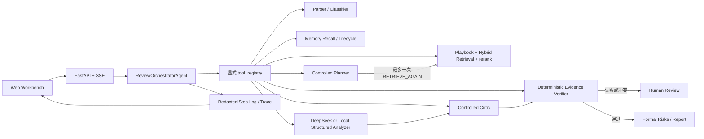

# ContractReviewAgent

开发过程中实际遇到的问题、技术权衡和方案变更持续记录在 [DEVELOPMENT_DECISIONS.md](DEVELOPMENT_DECISIONS.md)。

当前实现范围：`TASKS.md` 的任务 9、`TASKS_2.md` 的任务 10、`UI_REDESIGN_PLAN.md` 的工作台界面迭代、`TASKS_AGENT.md` 的任务 10，以及 `EVIDENCE_MANUAL_REVIEW_PLAN.md` 的证据失败人工闭环。系统支持 AgentState、显式 Tool Registry、DeepSeek OpenAI-compatible Provider、受控 Planner/Router、一次检索修复、受控 Critic、确定性 Evidence 最终准入、Prompt Injection 阻断、真实 token 预算、Memory 生命周期、可恢复执行、流式状态事件和脱敏 Agent Trace。HTTP 传输层使用 FastAPI / Uvicorn，并由同一服务托管前端；任务、上传文件、文档、条款、风险、日志和事件接入 SQLite 持久化。浏览器测试覆盖主流程、错误流、Agent 状态展示、三视口布局和基础可访问性。

## 当前已实现

1. FastAPI / Uvicorn 后端服务启动入口。
2. 后端健康检查接口。
3. 审查状态模型：`START`、`UPLOAD_RECEIVED`、`DOCUMENT_PARSED`、`CONTRACT_TYPE_CLASSIFIED`、`CLAUSES_STRUCTURED`、`PLAYBOOK_RETRIEVED`、`CONTEXT_BUILT`、`RISK_ANALYZED`、`EVIDENCE_VERIFIED`、`HUMAN_REVIEW_PENDING`、`MEMORY_UPDATED`、`REPORT_READY`、`UNSUPPORTED_CONTRACT_TYPE`、`PARSE_FAILED`、`RETRIEVAL_FAILED`、`LLM_OUTPUT_INVALID`、`EVIDENCE_MISSING`、`NEED_MANUAL_REVIEW`、`CANCEL_REQUESTED`、`CANCELLED`、`NODE_TIMEOUT`、`TASK_TIMEOUT`、`TASK_ERROR`。
4. FastAPI 同源托管前端页面和静态资源。
5. 独立的新建合同审查入口、合同文件上传和甲方 / 乙方审查立场选择。
6. 未选择合同文件或审查立场时不能上传解析。
7. Workbench 布局：全局工作区导航、顶部任务命令栏、左侧上下文与进度、中间合同原文与证据、右侧风险检查器、底部执行记录抽屉。
8. 基于 Docling 的 DOCX 段落和表格解析。
9. 基于 Docling Standard Pipeline 的中英文 PDF 解析，支持按需 OCR 和表格结构识别，保留页码、文本块顺序和边界坐标，并将条款位置回溯到对应 PDF 页和块。
10. 条款编号、条款正文、条款类型、关键字段和原文位置结构化。
11. 完整显式 `tool_registry` 字典和工具输入输出契约。
12. 当前解析链路通过 `ReviewOrchestratorAgent` 调度，并只通过 `tool_registry` 调用工具。
13. 后端通过 Server-Sent Events 输出任务状态事件。
14. 前端实时展示状态进度和执行日志。
15. 本地 JSON NDA Risk Playbook，覆盖第一版 8 类核心风险。
16. `retrieve_playbook_rules` 已通过显式 `tool_registry` 调用，并按合同类型、条款类型、关键字段和审查立场检索规则。
17. 前端展示命中的 Playbook 规则；未命中规则时不会生成正式风险。
18. `retrieve_related_clauses` 已通过显式 `tool_registry` 调用；支持 `local_sparse` 离线测试模式和 `openai_compatible` 真实 Embedding 模式，在当前合同条款内合并关键词与 Embedding 候选、去重，并执行动态 Top-K 和可解释 rerank。
19. `retrieve_memory` 已通过显式 `tool_registry` 调用；SQLite Memory 先按合同类型和审查立场硬过滤，再使用与 RAG 相同的 Embedding Provider、余弦相似度和精确字段因子排序。语义偏好向量按模型、维度和内容哈希持久化，内容变化后惰性刷新，不跨立场注入。
20. 后端构建风险分析上下文，包含当前条款、命中规则、相关条款、相关 Memory 字段、输出约束和证据约束。
21. `analyze_risk` 已通过显式 `tool_registry` 调用；新建审查可按任务选择 `local_structured` 或 `openai_compatible`，本地模式不会记录为真实外部 LLM 调用。
22. `verify_evidence` 已通过显式 `tool_registry` 调用，校验 `clause_id`、`evidence_text`、风险原因与证据文本相关性，以及命中规则一致性。
23. `generate_revision` 已通过显式 `tool_registry` 调用，并与风险分析共用结构化 LLM Provider 边界。
24. 前端展示上下文 Trace、自动验证通过或失败的风险候选、证据状态与失败原因、规则详情、证据文本、风险原因和修改建议。
25. 点击风险可定位到中间合同原文的对应证据；定位只滚动文档区，左右栏保持原位，目标已可见时不重复跳动。
26. 用户可以在合同原文中框选文本并发起局部审查，局部审查结果与正式风险列表分开展示。
27. 局部审查只返回当前框选文本的复核结果，不写入正式风险列表，不写入 Memory。
28. 用户可以对风险候选执行采纳、忽略、修改等级、修改建议，或采用当前风险同条款的框选原文作为人工证据，并选择是否加入报告。
29. 所有采纳、忽略和修改动作通过 `tool_registry["write_memory"]` 写入 SQLite Memory。
30. 后续相似审查会通过 `retrieve_memory` 召回相关 Memory；当 Memory 影响修改建议时，风险详情展示历史反馈引用。
31. 用户可以基于正式风险证据触发局部重审，局部结果仍不写入正式风险列表。
32. 用户可以导出 Markdown 审查报告，报告生成通过 `tool_registry["generate_report"]` 调用。
33. 报告包含合同名称、审查立场、Playbook 版本、风险等级、风险原因、原文证据、修改建议和人工反馈状态。
34. 所有风险候选处理完成前，前端和后端均拒绝报告导出；完成后只导出用户明确允许进入报告的风险，不包含完整执行日志和技术实现细节。
35. `samples/` 提供 23 份项目内合成合同标注，其中基础流程评测固定使用 10 份 NDA；样本来源已在 `samples/README.md` 说明。
36. `evaluation/` 支持手动触发基础评测摘要，覆盖任务是否跑通、文档解析、条款结构化、Playbook 命中、风险证据、Memory 写入、报告导出和失败原因。
37. 全部 HTTP API 已迁移到 FastAPI，请求模型使用 Pydantic 校验，文件上传使用 `UploadFile` 分块读取并校验大小、扩展名、MIME、文件签名、空文件和安全文件名。
38. SSE 使用 `StreamingResponse`，保留 `review_event` 事件格式，并在终态、客户端断开或服务关闭时结束。
39. 默认 CORS 不使用通配符；允许源由 `REVIEW_AGENT_ALLOWED_ORIGINS` 配置。
40. SQLite 使用轻量 Repository 持久化任务、文档、条款、风险、执行日志和 SSE 事件；状态、结果和事件在同一事务中提交。
41. 上传文件保存到 `REVIEW_AGENT_UPLOAD_DIR` 受控目录，数据库只记录任务生成的相对文件名和 SHA-256，不保存客户端原始路径。
42. 服务启动时加载历史任务；非终态任务校验上传文件和检查点后从最后完整节点继续，已成功节点不重复执行。
43. 文件缺失、SHA-256 不一致或检查点数据缺失时，任务进入 `NEED_MANUAL_REVIEW` 并保留实际原因。
44. 人工反馈 Memory 和报告生成使用稳定幂等键，重复请求不会重复写入 Memory 或生成多份同版本报告。
45. 合同类型先执行确定性分类，仅在低置信度时调用 LLM；非 NDA 在 Playbook 检索前停止。
46. 甲方、乙方审查立场会影响 Playbook 规则、风险重点、默认等级和修改建议。
47. OpenAI-compatible Provider 通过环境变量配置 Base URL、API Key、模型和超时；超时、限流、临时错误和结构错误最多重试一次。
48. 外部 LLM 日志记录模型、供应商请求 ID、prompt/completion token、调用耗时、错误类型和成本状态；未知价格显示“未配置”，本地模式显示 `no_external_llm`。
49. Embedding 查询包含当前条款正文、条款类型、风险类型、Playbook 检查点和关键字段；合同条款向量在单次任务上下文构建期间缓存，恢复时使用相同模型和输入重建。
50. 相关条款结果包含 Embedding 模式、模型、向量维度、余弦相似度、rerank 因子和最终分数；前端 Context Trace 展示模型、相似度和最终分数。
51. 外部 Embedding 调用日志记录模型、输入数量、向量维度、耗时、错误类型，以及供应商提供时的请求 ID；不记录 API Key 或完整合同文本，失败时进入 `RETRIEVAL_FAILED`，未启用静默词频降级。
52. `samples/annotations/related_clauses.json` 提供 20 组人工相关条款标注，覆盖 8 类 NDA 风险；离线测试直接运行本地混合检索并计算 Recall@1，不使用语义命中 Stub 代替实际检索结果。
53. `samples/annotations/` 提供 `effect-v3` 人工标注 schema，覆盖 23 份合同、174 条条款、65 条唯一风险条款、20 组相关条款、20 组带检索查询的 Memory 对照和 10 组 Prompt Injection；当前数据全部为项目内合成夹具。
54. `POST /api/evaluation/effect/run` 独立运行效果评测，不改写现有 `POST /api/evaluation/run` 流程评测响应。
55. 效果评测计算 27 项指标，包括 NDA 分类、非 NDA 拒绝、条款、Playbook/相关条款、风险、证据、人工复核、报告、工具、端到端、Planner、结构化输出、修复、恢复、无证据风险、Memory 偏好一致性、Memory Recall@K、Memory MRR、Memory 向量覆盖率、Embedding 调用成功率和 Injection；token、成本状态和 P95 延迟作为运行测量单独记录。
56. 每个效果指标记录样本数、通过数、失败数、阈值和失败样本；版本化 JSON/Markdown 摘要记录 Git、Playbook、标注、LLM、Embedding 和关键参数。
57. Web 评测面板使用“流程摘要”和“效果摘要”两个独立视图；未达阈值指标按实际失败状态展示。
58. 清晰扫描件通过按需 OCR 提取正文；空文本、OCR 无法识别、加密、复杂字体映射失败和损坏 PDF 会进入真实 `PARSE_FAILED` 状态，不生成伪造正文或正式风险。
59. 每个任务持久化 `trace_id`，每次工具调用持久化唯一 `step_id`；旧 SQLite 日志在初始化时生成确定性 Step 标识。
60. 任务恢复次数和恢复起点进入任务快照、API 响应和 Web 执行记录，服务重启后保留。
61. LLM/Embedding 执行摘要展示模型、token 或输入量、耗时、成本状态和错误类型，并在供应商提供时展示脱敏请求 ID；日志摘要屏蔽密钥、Authorization、完整 prompt 和完整任务正文。
62. SSE 在终态关闭但浏览器未消费最后一帧时，前端使用任务查询接口做一次真实状态对账，不自行构造成功状态。
63. Playwright Chromium E2E 覆盖首页、上传、SSE、风险定位和高亮、框选局部审查、人工反馈、Memory、报告过滤下载、流程评测、非 NDA、超限、解析失败、扫描 PDF 和服务错误提示。
64. Web 前端提供审查、Memory、评测三个真实数据工作区；风险筛选、条款导航、风险证据和人工操作状态在重渲染后保持一致。
65. 桌面端使用独立滚动的三栏工作台，移动端提供风险、合同、执行记录三种模式和固定人工操作栏；本地 Lucide SVG 图标不依赖在线 CDN。
66. Playwright 额外验证 1440×960、1280×800、390×844 三个视口无横向溢出、面板不重叠、图标资源可访问、键盘焦点和减少动态效果设置生效。
67. `plan_review_action` 作为第 13 个显式工具，只能返回四种白名单动作；Orchestrator 校验原因码、当前状态、当前合同条款和全任务一次重试预算后，才允许执行受限检索改写与重新分析。首次 Evidence 失败最多修复一次，再次失败进入 `EVIDENCE_MISSING`；正常确定性成功路径不调用 Planner。
68. `criticize_risk` 作为独立显式工具位于 Analyzer 与 Evidence Verifier 之间，只能返回 `PASS`、`REJECT` 或 `REQUEST_HUMAN_REVIEW` 及固定原因码；它不能返回新证据、条款、规则或风险等级。Critic 冲突进入人工复核，只有确定性 Evidence Verifier 通过的候选才可能进入正式风险列表。
69. Prompt 组装区分系统策略、任务、Playbook、合同数据、相关条款、Memory、证据约束和输出 Schema；合同与 Memory 作为不可信数据处理，注入信号不会触发额外工具或生成未绑定证据的正式风险。
70. Context Budget 使用项目内固定的 DeepSeek tokenizer 计算 token，并记录各上下文类别占用、裁剪原因、最终预算和 Prompt 版本；当前条款、Playbook、Schema 和证据约束不可被预算裁剪。
71. Memory 保留不可变人工反馈，同时聚合可追溯偏好；冲突并存、置信度可衰减、过期只影响派生偏好，不删除审计记录，也不能覆盖 Playbook 或合同证据。
72. 任务支持取消、节点/任务超时、固定错误重试预算、人工恢复和同任务并发保护；恢复历史、父 Step、重试序号、幂等键和决策摘要进入脱敏 Trace。
73. 已使用用户本机 Key 对固定的 2 份合成 NDA 子集完成两次真实 DeepSeek 稳定性运行。两轮均为 `completed_with_failures`；该结果只证明真实调用链已跑通，不代表 23 份完整标注集效果达标。
74. Web Workbench 的执行记录可区分本地模式、DeepSeek 真实调用、Planner、一次检索修复、Critic、Evidence、Memory、Injection 阻断、取消、超时和人工恢复；高风险、证据失败和冲突结果持续显示人工复核提示。
75. 新建审查入口提供任务级 DeepSeek 开关；任务选择、实际调用成功和调用失败分别显示，不把“已选择”伪装成“已调用”。
76. 完整任务状态继续由 SQLite 保存；浏览器只保存当前任务 ID，刷新后通过任务查询接口恢复文档、条款、风险、反馈、日志和事件，后端重启后仍可读取。
77. 条款字段、Playbook、上下文、风险分析和证据验证按工作项增量写入进度、部分结果和日志；关键字段、风险分析和证据候选可从 SQLite 已完成项继续，不在超时恢复时从阶段起点重复调用。
78. 工具超时线程复制任务上下文，本地任务不会因全局 DeepSeek 配置而越界调用外部模型。
79. LangGraph 节点超时默认 90 秒，不再使用应用层累计任务时限；RQ 硬超时默认 7200 秒并预留 120 秒状态落库窗口。关键字段和首次风险分析使用默认 2、最大 4 的受控并发，运行日志另写入可轮转的本地文件。
80. SQLite 使用 WAL 与 `synchronous=NORMAL` 支持高频增量进度事务；细粒度 SSE 进度不重复保存完整历史任务快照，业务节点事件仍完整持久化。

## 当前未实现

仍未完成或未达标的事项如下：

1. 未使用 DeepSeek 对 23 份完整标注集完成两轮外部模型稳定性评测；当前真实运行只覆盖固定的 2 份合成 NDA 子集。
2. 真实 DeepSeek 两轮的 Evidence span、Memory 一致性和结构化修复指标未全部达标，且两轮波动明显；不能声明 Agent 效果验收通过。
3. 任务 9 Code Review 后的代码没有再次消耗 DeepSeek 复跑；现有外部结果对应 Review 前的未提交工作区，限制详见 `evaluation/release/agent-evolution-verification.md`。

迭代技术方案、实施顺序和验收口径见 `NEXT_PLAN.md`、`TASKS_2.md`、`UI_REDESIGN_PLAN.md`、`AGENT_EVOLUTION_PLAN.md`、`TASKS_AGENT.md` 和 `DEEPSEEK_TIMEOUT_PLAN.md`；这些文件保留计划形成过程，当前完成状态以代码、测试和本 README 为准。

当前基础评测只验证流程跑通，不声明生产级准确率。生产默认 Embedding 路径为 `openai_compatible`；`local_sparse` 仅用于显式离线回归。`BAAI/bge-m3` 已在固定 `effect-v3` 数据集上完成两轮真实外部 Embedding 评测，两轮检索指标一致且 Provider 调用全部成功；这仍不等于证明真实合同上的生产效果。真实 DeepSeek 子集运行验证了外部 LLM 调用链，也不等于证明模型效果稳定或达到生产要求。

当前 `effect-v3` 包含 23 份合同、174 条条款、65 条唯一风险条款、20 组相关条款、20 组 Memory 检索/偏好对照和 10 组 Prompt Injection。量化结果以 `evaluation/release/model-embedding-memory-verification.md` 的实际运行记录为准；这些合成样本上的真实模型结果不能外推为真实合同或生产准确率。

当前 14 个工具均已在 `tool_registry` 中注册契约。`classify_contract_type`、`extract_key_fields`、`analyze_risk`、`criticize_risk`、`plan_review_action` 和 `generate_revision` 具备 LLM Provider 调用边界；默认 `local_structured` 模式下 Critic 和 Planner 使用确定性策略，不记录为真实外部 LLM 调用。

## Agent 架构



Planner 只能选择白名单动作，Orchestrator 才能执行工具；Critic 不能创建证据；Evidence Verifier 拥有正式风险最终准入权。合同正文、Memory 和工具返回均按不可信数据处理，DeepSeek Key、Authorization、完整 Prompt 和完整合同不进入 Trace。

## 已验证失败案例

1. DeepSeek Key、Base URL 或模型配置缺失时，创建外部模式任务会返回明确配置错误，不静默回退为本地成功。
2. Planner 非法动作、未知条款、越权状态或耗尽重试预算会被拒绝，不执行对应工具。
3. Evidence 第一次失败最多执行一次受限检索修复；再次失败进入人工复核或 `EVIDENCE_MISSING`。
4. Critic 冲突、无效结构化输出和 Prompt Injection 信号不会生成可确认的正式风险。
5. 取消、节点超时和任务超时保留已完成日志；可恢复状态必须由人工提供原因后恢复，重试预算不会因重启重置。

## 项目表述边界

可以表述为：已实现显式 Tool Registry、受控 Planner/Critic、确定性 Evidence 准入、混合检索、Memory 生命周期、可恢复执行和脱敏 Trace，并用真实 DeepSeek Key 在 2 份合成 NDA 子集上完成两次稳定性运行。

不得表述为：完整标注集已通过 DeepSeek 效果验收、达到生产级准确率、Memory 已证明提升效果、真实外部 Embedding 已达到生产级效果，或所有指标均已达标。

## PDF 支持边界

PDF 使用 Docling Standard Pipeline 统一解析普通中文、英文文本型文件和清晰扫描件。OCR 按需启用，不强制对已有文本层的整页重复识别；表格通过 TableFormer 识别并映射为 `table` 文本块。解析结果按页输出文本块，并为每个块记录 `page_number` 和 `bbox`；条款通过 `source_location.pdf_blocks` 回溯到原 PDF 页码、块 ID 和坐标。证据验证完成后，正式风险的 `evidence_location.pdf_blocks` 会记录证据实际命中的页码、块 ID、`bbox` 和块内字符范围，不只依赖 `clause_id` 间接定位整条条款。

OCR 无法识别的低清扫描件和无有效文本文件不会进入合同类型识别或正式风险分析。加密 PDF 不提供密码输入或解密流程；复杂字体无法可靠映射 Unicode、文件损坏、结构不完整或解析超时时均返回对应真实原因。当前不启用 VLM，不承诺手写体、严重倾斜、模糊图像或复杂跨页表格的识别效果。

`samples/pdf/` 和 `backend/tests/fixtures/pdf/` 中的文件均为项目内合成测试材料，来源和用途见各目录 README，不包含真实客户或未经授权的合同文本。

## 运行依赖

1. `fastapi`：提供 ASGI 应用、路由、Pydantic 请求校验和静态文件集成。
2. `uvicorn`：运行 FastAPI ASGI 应用。
3. `python-multipart`：解析 `multipart/form-data` 合同上传请求。
4. `python-dotenv`：应用启动时读取项目根目录 `.env`，已存在的进程环境变量保持优先。
5. `httpx`：供 FastAPI `TestClient` 执行 API 契约测试，并执行 OpenAI-compatible HTTP 调用。
6. `docling`：使用 Standard PDF Pipeline、RapidOCR 和 TableFormer 解析 PDF，并统一读取 DOCX；固定为 `2.115.0`，默认使用 CPU、本地模型且不启用 VLM 或远程服务。
7. `python-docx`：生成项目评测与测试使用的合法 DOCX Office 包，固定为 `1.2.0`。
8. `pdfplumber`：只用于 PDF 签名、加密、损坏和复杂字体失败诊断，不再承担正文与坐标提取；固定为 `0.11.10`。
9. Node.js、pnpm 和 `playwright@1.60.0`：只用于 Chromium 浏览器 E2E，不属于应用运行依赖。

安装：

```powershell
$python = Join-Path $env:REVIEW_AGENT_RUNTIME_ROOT "venv\Scripts\python.exe"
& $python -m pip install -r requirements.txt
& $python scripts/prepare_docling_models.py
pnpm install --frozen-lockfile
pnpm exec playwright install chromium
```

`scripts/prepare_docling_models.py` 将固定 revision 的 Layout、TableFormer accurate 和 RapidOCR torch/chinese 模型写入 `REVIEW_AGENT_DOCLING_ARTIFACTS_PATH`。未配置该变量时使用 `REVIEW_AGENT_RUNTIME_ROOT\models\docling`；两个变量都缺失时脚本直接失败，不回退到用户 C 盘缓存。

## DeepSeek 配置

Key 通过 `REVIEW_AGENT_LLM_API_KEY` 提供，不写入代码、README 或受版本控制的文件。应用启动时使用 `python-dotenv` 自动读取项目根目录的 `.env`；`.env` 已被 `.gitignore` 排除，`.env.example` 只提供变量名和非敏感示例。加载使用 `override=False`，因此 CI、容器或 PowerShell 中已经设置的进程环境变量优先于 `.env`。

本地 `.env` 可以直接配置：

```dotenv
REVIEW_AGENT_LLM_MODE=openai_compatible
REVIEW_AGENT_LLM_BASE_URL=https://api.deepseek.com
REVIEW_AGENT_LLM_API_KEY=<your-deepseek-key>
REVIEW_AGENT_LLM_MODEL=deepseek-v4-pro
REVIEW_AGENT_LLM_MAX_CONCURRENCY=2
```

Embedding 使用独立 Provider，配置在同一个项目根目录 `.env`，不要复用或猜测 DeepSeek 聊天模型的 Embedding 能力：

```dotenv
REVIEW_AGENT_EMBEDDING_MODE=openai_compatible
REVIEW_AGENT_EMBEDDING_BASE_URL=<your-embedding-provider-v1-base-url>
REVIEW_AGENT_EMBEDDING_API_KEY=<your-embedding-provider-key>
REVIEW_AGENT_EMBEDDING_MODEL=<your-embedding-model>
REVIEW_AGENT_EMBEDDING_TIMEOUT_SECONDS=60
```

配置完成后直接启动：

```powershell
python -m uvicorn main:app --app-dir backend/app --host 127.0.0.1 --port 8000
```

需要临时覆盖 `.env` 时，可在 PowerShell 启动前设置当前进程环境：

```powershell
$env:REVIEW_AGENT_LLM_MODE = "openai_compatible"
$env:REVIEW_AGENT_LLM_BASE_URL = "https://api.deepseek.com"
$env:REVIEW_AGENT_LLM_API_KEY = "<your-deepseek-key>"
$env:REVIEW_AGENT_LLM_MODEL = "deepseek-v4-pro"
python -m uvicorn main:app --app-dir backend/app --host 127.0.0.1 --port 8000
```

未配置 Key 时服务仍可启动；界面打开 DeepSeek 开关创建任务时会返回配置错误。默认代码配置是 `local_structured`，而 `.env.example` 有意展示 DeepSeek 外部模式。成本单价未配置时只记录 token 和“未配置”，不推测金额。

## 运行服务

```powershell
python -m uvicorn main:app --app-dir backend/app --host 127.0.0.1 --port 8000
```

页面：

```text
http://127.0.0.1:8000/
```

健康检查：

```text
http://127.0.0.1:8000/health
```

## 验证当前版本

1. 使用上述唯一启动命令启动服务。
2. 访问 `http://127.0.0.1:8000/health`，确认返回 `status: ok`。
3. 访问 `http://127.0.0.1:8000/`，确认页面和 `/src/` 静态资源由同一服务返回。
4. 确认浏览器请求使用同源 `/api/*` 地址，没有独立前端服务。
5. 确认首页有合同上传入口和甲方 / 乙方审查立场选择。
6. 不选择合同文件或审查立场时，确认按钮不可用。
7. 上传 `.docx` 或 `.pdf` 并选择审查立场。
8. 确认右侧流式进度展示 `START`、`UPLOAD_RECEIVED`、`DOCUMENT_PARSED`、`CLAUSES_STRUCTURED`、`PLAYBOOK_RETRIEVED`、`CONTEXT_BUILT`、`RISK_ANALYZED`、`EVIDENCE_VERIFIED`；如果存在高风险或低置信度风险，则最终进入 `HUMAN_REVIEW_PENDING`。
9. 确认 Workbench 左侧显示条款编号、条款正文、条款类型和关键字段。
10. 确认右侧展示命中的 Playbook 规则；未命中时提示不会生成正式风险。
11. 确认右侧展示上下文 Trace，包含当前条款、相关条款、相关 Memory 和约束信息。
12. 确认右侧展示已验证风险列表、证据文本和修改建议；无证据风险不得展示为正式风险。
13. 点击风险列表中的定位按钮，确认左侧跳转到对应条款，并能看到证据高亮。
14. 在左侧条款原文中框选文本，点击局部审查，确认右侧展示局部审查结果，且正式风险列表不被改写。
15. 框选不属于该条款的文本调用局部审查接口时，确认返回友好错误。
16. 在风险详情中执行采纳、忽略、修改等级、修改建议，确认任务状态更新为 `MEMORY_UPDATED`，风险复核状态、报告选择和 Memory ID 可见。
17. 对风险点击局部重审，确认以该风险证据文本发起局部审查，正式风险列表不被改写。
18. 确认底部执行记录显示 `parse_document`、`extract_clauses`、`extract_key_fields`、`retrieve_playbook_rules`、`retrieve_related_clauses`、`retrieve_memory`、`analyze_risk`、`criticize_risk`、`generate_revision`、`verify_evidence`、`write_memory` 的工具名、状态、耗时、摘要和真实 token/cost 摘要；异常修复路径还应显示 `plan_review_action`。本地结构化工具应显示 `*_no_external_llm`，不能显示外部 LLM 计量占位。
19. 对需要进入报告的风险提交人工反馈并勾选加入报告，点击导出报告，确认浏览器下载 Markdown 文件，且后端任务状态变为 `REPORT_READY`。
20. 确认报告只包含已允许进入报告的风险，不包含未加入报告的忽略风险、待人工复核但未确认风险、完整执行日志或技术实现细节。
21. 点击基础评测中的运行评测，确认返回 10 份合成 NDA 样本的摘要；摘要包含样本名称、任务跑通、文档解析、条款结构化、Playbook 命中、风险证据、Memory 写入、报告导出和失败原因。
22. 访问 `http://127.0.0.1:8000/api/tools`，确认 14 个工具都有输入输出契约、`runtime_calls_llm`、`runtime_llm_mode`；Planner 输出只包含白名单动作、固定原因码、当前条款、受限查询调整和置信度，Critic 输出只包含三种决策和固定原因码。
23. 上传相似合同后，确认相关 Memory 能进入上下文 Trace；当 Memory 影响建议时，风险详情展示历史反馈引用。
24. 上传不支持或不可解析文件时，确认状态进入错误提示，不显示伪造解析结果。
25. 服务重启后使用原任务 ID 查询，确认任务、条款、风险、日志、事件和反馈仍然存在。
26. 对非终态任务执行重启验证时，确认事件中出现 `recovery_started`，恢复记录包含恢复次数和起点，已完成工具没有重复日志。
27. 显式设置 `REVIEW_AGENT_EMBEDDING_MODE=local_sparse` 完成离线审查，确认相关条款和 Memory 结果包含本地模型标识、固定维度、余弦相似度和排序因子，且执行日志标记 `local_sparse_no_external_embedding`；该验证不得写成真实模型结果。
28. 配置 `openai_compatible` Embedding 后，确认日志显示实际模型、输入数量、向量维度和耗时，并在供应商提供请求 ID 时保存脱敏摘要；让供应商返回错误时，确认任务进入 `RETRIEVAL_FAILED` 且没有 `lexical_fallback`。
29. 在评测面板切换“流程摘要”和“效果摘要”，确认两者结果和加载/失败状态彼此独立。
30. 运行效果评测，确认返回 27 个指标，且每项包含样本数、通过数、失败数、阈值、达标状态和失败样本；样本数为 0 时必须显示“无样本”且不得视为达标。相关条款与 Memory 检索分别显示 Recall@K，Memory 同时显示 MRR 和向量覆盖率，Embedding 显示调用成功率。
31. 确认效果摘要显示 Git、Playbook、标注、LLM 和 Embedding 版本，并在 `evaluation/effect/` 生成以评测 ID 命名的 JSON 和 Markdown 文件。
32. 上传 `samples/pdf/nda_text_zh.pdf` 和 `samples/pdf/nda_text_en.pdf`，确认正文按页解析，条款 `source_location` 包含页码、块 ID 和 `bbox`；正式风险的 `evidence_location` 精确到证据命中的 PDF 块和块内字符范围。
33. 上传 `backend/tests/fixtures/pdf/scanned_image.pdf`，确认按需 OCR 提取 `SCANNED NDA IMAGE - NO PDF TEXT LAYER`，任务继续进入合同类型判断而不是 `PARSE_FAILED`，且文本块包含页码和 `bbox`。
34. 使用加密、复杂字体映射失败或损坏 PDF 时，确认界面展示具体解析原因，不显示文档解析成功。
35. 展开 Agent 执行记录，确认任务 Trace、工具 Step、恢复信息和 Provider 摘要可读；本地模式与 DeepSeek 真实调用明确区分，且不出现密钥、完整合同 Prompt 或前端堆栈。
36. 确认配置错误、Planner 非法动作、一次检索修复、Injection 阻断、取消、超时和恢复均有浏览器验收状态，且没有把夹具状态写入生产任务 API。
37. 运行 Playwright，确认 15 个 Chromium 主流程、错误流、Agent 状态、三视口和可访问性用例均实际通过；每次运行使用独立的数据库、上传、报告和评测目录，浏览器和测试数据写入本机缓存或已忽略目录，不进入 Git。

默认上传请求大小上限为 10 MB，可通过 `REVIEW_AGENT_MAX_UPLOAD_BYTES` 调整。
默认 CORS 不允许通配来源；可通过逗号分隔的 `REVIEW_AGENT_ALLOWED_ORIGINS` 配置明确来源。
默认 SQLite 业务与 Memory 数据库路径为 `backend/app/data/review_agent_memory.sqlite3`，可通过 `REVIEW_AGENT_MEMORY_DB_PATH` 调整。
默认上传目录为 `backend/app/data/uploads`，可通过 `REVIEW_AGENT_UPLOAD_DIR` 调整。
默认报告目录为 `backend/app/reports`，可通过 `REVIEW_AGENT_REPORT_DIR` 调整；默认评测输出目录为 `evaluation`，可通过 `REVIEW_AGENT_EVALUATION_OUTPUT_DIR` 调整。
新建审查默认选择 `local_structured`；界面打开 DeepSeek 开关后，该任务固定使用 `openai_compatible`。外部 Provider 的连接与凭据通过 `REVIEW_AGENT_LLM_BASE_URL`、`REVIEW_AGENT_LLM_API_KEY`、`REVIEW_AGENT_LLM_MODEL` 和 `REVIEW_AGENT_LLM_TIMEOUT_SECONDS` 配置，任务选择会随完整任务状态写入 SQLite。
默认 LLM 上下文预算为 6000 tokens，可通过 `REVIEW_AGENT_LLM_CONTEXT_BUDGET_TOKENS` 调整；值必须是正整数。
可通过 `REVIEW_AGENT_LLM_PROMPT_COST_PER_1M` 和 `REVIEW_AGENT_LLM_COMPLETION_COST_PER_1M` 配置每百万 token 单价；未配置时日志显示“未配置”。
生产默认 Embedding 模式为 `openai_compatible`，通过 `REVIEW_AGENT_EMBEDDING_BASE_URL`、`REVIEW_AGENT_EMBEDDING_API_KEY`、`REVIEW_AGENT_EMBEDDING_MODEL` 和 `REVIEW_AGENT_EMBEDDING_TIMEOUT_SECONDS` 配置。`local_sparse` 只允许作为显式离线测试模式使用。
LangGraph Orchestrator 默认单节点超时为 90 秒，可通过 `REVIEW_AGENT_NODE_TIMEOUT_SECONDS` 调整；不再按任务累计运行时长判失败。RQ Worker 使用 `REVIEW_AGENT_RQ_JOB_TIMEOUT_SECONDS`（默认 7200 秒）作为进程外最终硬边界，并通过 `REVIEW_AGENT_RQ_STATUS_RESERVE_SECONDS`（默认 120 秒）预留状态落库窗口。`REVIEW_AGENT_LLM_MAX_CONCURRENCY` 控制彼此独立的关键字段和首次风险分析调用，默认 2、最大 4；同一风险内部的 Planner、Critic、修订和 Evidence 依赖链仍保持串行。解析、检索、LLM 输出、Evidence、节点超时和通用任务错误的人工恢复预算各为 2 次，服务重启不会重置。
设置 `REVIEW_AGENT_RUNTIME_ROOT` 后，服务运行日志默认写入该根目录下的 `logs/review_agent.log`；未设置时才回退到 `backend/app/logs/review_agent.log`。可通过 `REVIEW_AGENT_RUNTIME_LOG_FILE` 和 `REVIEW_AGENT_RUNTIME_LOG_LEVEL` 调整。日志只记录脱敏任务、阶段、工具、耗时与错误摘要；业务 Trace 仍是产品内审计数据。

## 运行测试

```powershell
$env:REVIEW_AGENT_LOAD_DOTENV = "0"
$env:REVIEW_AGENT_LLM_MODE = "local_structured"
$env:REVIEW_AGENT_EMBEDDING_MODE = "local_sparse"
python -m unittest discover -s backend\tests -p "test_*.py"
pnpm test:e2e
Remove-Item Env:REVIEW_AGENT_EMBEDDING_MODE
Remove-Item Env:REVIEW_AGENT_LLM_MODE
Remove-Item Env:REVIEW_AGENT_LOAD_DOTENV
```

后端测试和 Playwright 测试服务显式设置 `REVIEW_AGENT_LOAD_DOTENV=0`，避免本机 `.env` 中的真实 Provider、数据库和输出目录污染隔离测试；应用正常启动时不设置该变量，会自动加载 `.env`。

当全量 `unittest discover` 无法在合理时间内结束时，使用逐模块超时入口定位具体模块；该脚本不会把超时当作通过：

```powershell
powershell -ExecutionPolicy Bypass -File scripts\run_backend_tests.ps1 -PerModuleTimeoutSeconds 180
```

## PostgreSQL 数据迁移

Agent 框架迁移计划见 `AGENT_FRAMEWORK_MIGRATION_PLAN.md`。当前应用运行仓储仍是 SQLite；PostgreSQL schema 和数据迁移已经建立，但在最终直接切换前不会并行维护两套业务写入。

本机便携 PostgreSQL 使用 `REVIEW_AGENT_RUNTIME_ROOT` 定位，不依赖 Docker。启停和状态检查：

```powershell
powershell -ExecutionPolicy Bypass -File scripts\manage_postgres.ps1 -Action start
powershell -ExecutionPolicy Bypass -File scripts\manage_postgres.ps1 -Action status
powershell -ExecutionPolicy Bypass -File scripts\manage_postgres.ps1 -Action stop
```

数据库连接只通过 `REVIEW_AGENT_DATABASE_URL` 提供。先执行 Alembic，再从只读 SQLite 源运行 dry-run 或 apply：

```powershell
$env:PYTHONPATH = "backend\app"
$runtimeRoot = $env:REVIEW_AGENT_RUNTIME_ROOT
if (-not $runtimeRoot) {
  $runtimeRoot = [Environment]::GetEnvironmentVariable("REVIEW_AGENT_RUNTIME_ROOT", "User")
}
& "$runtimeRoot\venv\Scripts\alembic.exe" -c alembic.ini upgrade head
& "$runtimeRoot\venv\Scripts\python.exe" -m db.sqlite_migration --source backend\app\data\review_agent_memory.sqlite3 --mode dry-run
& "$runtimeRoot\venv\Scripts\python.exe" -m db.sqlite_migration --source backend\app\data\review_agent_memory.sqlite3 --mode apply
```

迁移器校验每张表的行数、任务 ID、每任务最大事件序号和规范化 JSON 哈希。重复 apply 使用 `ON CONFLICT DO NOTHING`，不会覆盖已有不同数据；任何目标差异都会使事务失败，不能写成迁移成功。

## pgvector 与本地 BGE 检索

RQ Worker 的 `retrieve_related_clauses` 工具使用 PostgreSQL 混合检索：`BAAI/bge-m3` 1024 维向量召回 Top 20，`pg_trgm` 关键词召回 Top 20，RRF `k=60` 合并后由 `BAAI/bge-reranker-base` 重排 Top 20，最终最多返回 5 条。HNSW 参数固定为 `m=16`、`ef_construction=64`、`ef_search=80`，过滤查询启用 `iterative_scan=strict_order`。

模型名称、精确 revision、设备、批大小和缓存目录通过 `REVIEW_AGENT_BGE_*` 配置；Embedding 与检索 Redis 缓存 TTL 分别由 `REVIEW_AGENT_EMBEDDING_CACHE_TTL_SECONDS`（默认 604800）和 `REVIEW_AGENT_RETRIEVAL_CACHE_TTL_SECONDS`（默认 3600）控制。缓存键包含模型、revision 和内容哈希，Redis 不可用时回源 PostgreSQL/BGE，不承担不可恢复数据。

模型文件不进入仓库。本机通过 `REVIEW_AGENT_BGE_CACHE_DIR` 指向 `D:\demo-runtime\models\huggingface`。数据库必须已安装 `vector` 和 `pg_trgm` 扩展并执行 Alembic 到 head；缺少扩展时迁移应明确失败，不能降级成看似成功的非向量检索。

当前只有 PostgreSQL/RQ 路径使用该检索器；默认 FastAPI 入口仍使用 SQLite 兼容路径，任务 10 一次性切换后才删除旧检索实现。真实 61 条款 CPU 验收完成了向量持久化、混合召回和 BGE 重排，约 25.9 秒；该结果不等于 DeepSeek 效果或真实标注集召回率已达标。

## Redis、RQ 与跨进程事件流

任务 3 已建立独立的 PostgreSQL/RQ 执行组件，但现有 FastAPI 默认入口仍保持 SQLite + 进程内执行，最终只在任务 10 一次性切换，不维护长期双写。便携 Redis、AOF、Worker 日志和 PID 文件都位于 `REVIEW_AGENT_RUNTIME_ROOT`：

```powershell
.\scripts\manage_redis.ps1 -Action start
.\scripts\manage_redis.ps1 -Action status
.\scripts\manage_worker.ps1 -Action start
.\scripts\manage_worker.ps1 -Action status
```

RQ 队列名默认 `review-agent`，只注册 1 个 Worker；任务硬超时为 7200 秒，旧编排器过渡路径在 7080 秒停止并预留 120 秒写入真实状态。RQ 不配置整任务重试，稳定 Job ID 为 `review-{task_id}`。

Worker 使用 `PostgresReviewPersistence` 保存任务、文档、条款、风险、日志和全部过程事件。事务提交后才发布 Redis 通知；SSE 先确认订阅，再查询 PostgreSQL，收到通知后重新查询。Redis 通知失败时轮询 PostgreSQL，因此 Redis 不承担不可恢复的任务数据。

外部依赖集成测试默认跳过，显式验收命令如下：

```powershell
$env:REVIEW_AGENT_RUN_EXTERNAL_TESTS = "1"
python -m unittest discover -v -s backend/tests -p test_postgres_rq_events.py
```

2026-07-24 已使用用户提供的 `Confidentiality Agreement.pdf` 完成一次本地模式真实队列验收：RQ Worker 用时 76.8 秒，PostgreSQL 持久化 212 个递增事件，最终状态为 `EVIDENCE_VERIFIED`。该结果验证任务基础设施，不代表 DeepSeek 或检索效果验收。

## LangGraph Checkpoint 与人工复核

RQ Worker 使用 PostgresSaver 将执行控制状态写入独立 `langgraph` schema，`thread_id` 固定等于 `task_id`。Checkpoint 只保存执行阶段、待处理风险 ID 和恢复次数；完整合同、条款、风险、事件和审计数据仍以 PostgreSQL `app` schema 为唯一业务真相源。Alembic 只管理 `app` schema，`langgraph` 中的包管理表不参与业务迁移差异比较。

人工复核节点通过 `interrupt()` 暂停。采纳、忽略、修改等级、修改建议或补充证据后，接口先幂等提交业务反馈，再使用 `Command(resume=...)` 推进同一线程。仍有待处理风险时再次暂停，全部处理后进入 `MEMORY_UPDATED`。控制图恢复不重新读取合同上传文件，也不会在 Checkpoint 异常时覆盖已经成功提交的反馈。

PostgreSQL Checkpointer 集成测试默认跳过，显式验收命令如下：

```powershell
$env:REVIEW_AGENT_RUN_EXTERNAL_TESTS = "1"
python -m unittest backend.tests.test_langgraph_checkpoint.PostgresCheckpointIntegrationTest -v
```

当前默认 FastAPI 入口仍是 SQLite 和进程内 Checkpointer；PostgreSQL、RQ 和 PostgresSaver 的默认切换在迁移任务 10 一次性完成，当前不双写业务数据。

## LangGraph Postgres Store Memory

RQ Worker 使用 `langgraph.store.postgres.PostgresStore` 保存人工反馈 Episode 和聚合偏好。合同类型与审查立场是 namespace 级硬隔离条件；现有冲突、过期、置信度衰减、Playbook 优先和证据约束规则继续由领域层决定，Store 不会让历史偏好覆盖当前规则或合同原文。

Memory 向量与条款检索共享同一个 `BAAI/bge-m3` Provider，使用 1024 维归一化向量、余弦距离和 HNSW `m=16`、`ef_construction=64`、`ef_search=80`。反馈写入不会同步冷启动 BGE；聚合偏好在下一次 Worker 检索时按内容哈希惰性建立或刷新索引。排序权重保持为向量相似度 0.7、条款类型精确命中 0.15、风险类型精确命中 0.15。

LangGraph Store 自己管理 PostgreSQL `app` schema 中的 `store`、`store_vectors`、`store_migrations` 和 `vector_migrations` 表，Alembic 不管理这些表。原 `memory_items` 和 `semantic_preferences` 仅作为一次迁移来源；稳定幂等键防止同一人工反馈生成重复 Episode。

外部集成测试默认跳过，显式验收命令如下：

```powershell
$env:REVIEW_AGENT_RUN_EXTERNAL_TESTS = "1"
python -m unittest backend.tests.test_langgraph_memory_store -v
```

当前只有 PostgreSQL/RQ Agent 路径使用 Postgres Store；默认 FastAPI/SQLite 入口仍使用原 Memory Repository，任务 10 才一次性切换。现有验证证明持久化、迁移和向量召回路径可运行，不代表 Memory 已证明改善 DeepSeek 风险判断效果。
